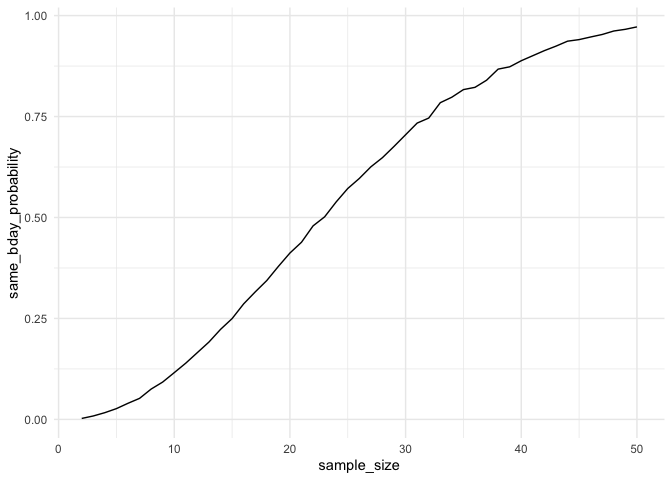
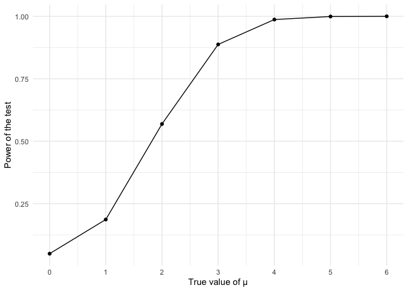
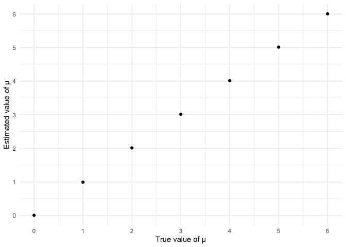
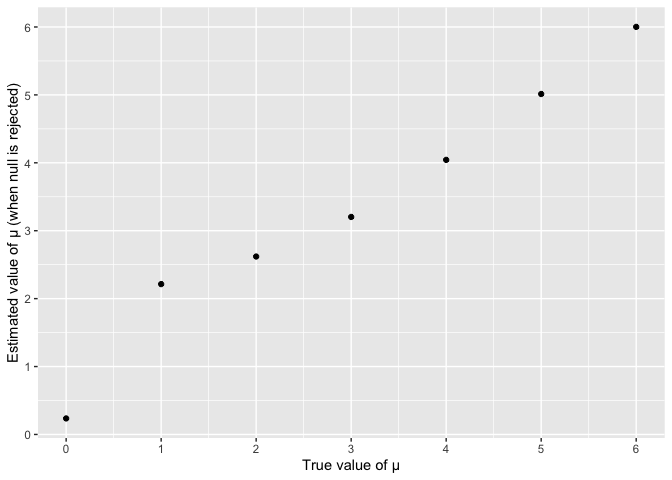

p8105_hw5_sy3352
================
Su Yan
2025-11-05

## Problem 1

``` r
same_bday = function(n) {
  generated_bday = sample(1:365, n, replace = TRUE)
  tibble(duplicate_bday = any(duplicated(generated_bday)))
}

sim_results_df = 
  expand_grid(
    sample_size = 2:50,
    iter = 1:10000
  ) |> 
  mutate(
    estimate_df = map(sample_size, same_bday)
  ) |> 
  unnest(estimate_df)

same_bday_prob = sim_results_df |> 
  group_by(sample_size) |> 
  summarize(same_bday_probability = mean(duplicate_bday))

same_bday_prob_pt = same_bday_prob |> 
  ggplot(aes(x = sample_size,
             y = same_bday_probability)) + 
  geom_line()
same_bday_prob_pt
```

<!-- -->

## Problem 2

``` r
each_sample_test = function(mean_repeat) {
  x = rnorm(30, mean = mean_repeat, sd = 5)
  t.test(x, mu = 0, alternative = c("two.sided"), conf.level = 0.95) |> 
    broom::tidy()
}

sim_normal_datasets = 
  expand_grid(
    mean_repeat = 0:6,
    iter = 1:5000
  ) |> 
  mutate(
    sim_normal_df = map(mean_repeat, each_sample_test)) |> 
  unnest(sim_normal_df)

normal_results = sim_normal_datasets |> 
  select(mean_repeat, estimate, p.value) |> 
  mutate(power = if_else(p.value < 0.05, "Reject", "Fail")) 

power_prob = normal_results |> 
  select(-p.value) |> 
  group_by(mean_repeat) |> 
  summarize(estimate_mean = mean(estimate),
            power_proportion = mean(power == "Reject"))

effect_size_power_pt = power_prob |> 
  ggplot(aes(x = mean_repeat,
             y = power_proportion)) + 
  geom_point() + 
  scale_x_continuous(breaks = 0:6) +
  labs(x = "True value of μ", y = "Power of the test")
effect_size_power_pt
```

<!-- -->

``` r
estimate_true_mean_pt = power_prob |> 
  ggplot(aes(x = mean_repeat,
             y = estimate_mean)) + 
  geom_point() + 
  scale_x_continuous(breaks = 0:6) +
  scale_y_continuous(breaks = 0:6) +
  labs(x = "True value of μ", y = "Estimated value of μ")
estimate_true_mean_pt
```

<!-- -->

``` r
estimate_mean_reject_pt = normal_results |> 
  select(-p.value) |> 
  filter(power == "Reject") |> 
  group_by(mean_repeat) |> 
  summarize(estimate_mean = mean(estimate)) |> 
  ggplot(aes(x = mean_repeat,
             y = estimate_mean)) + 
  geom_point() + 
  scale_x_continuous(breaks = 0:6) +
  scale_y_continuous(breaks = 0:6) +
  labs(x = "True value of μ", y = "Estimated value of μ (when null is rejected)")
estimate_mean_reject_pt
```

<!-- -->
